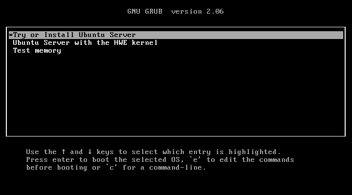
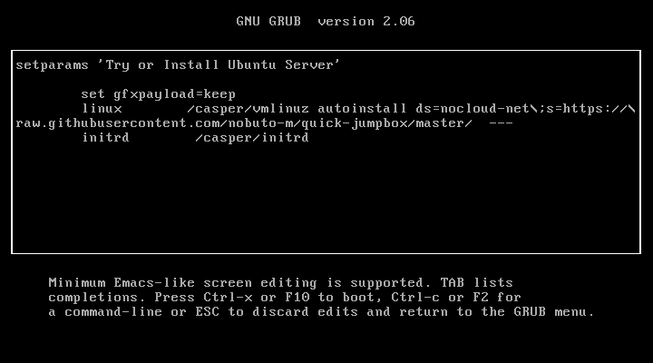

The steps below cover how to create a Linux based jumpbox briefly.
## Installation

1. Make sure BIOS configuration as `Restore on AC Power Loss: Power On`
   is set if the item exists, in order to cooperate with a smart plug or
   a power outage to be always on.

1. On a separate machine, get [the Ubuntu server image with the latest LTS version](https://ubuntu.com/download/server)

1. On the separate machine, create a USB startup disk
   ([Ubuntu](https://tutorials.ubuntu.com/tutorial/tutorial-create-a-usb-stick-on-ubuntu),
   [Windows](https://tutorials.ubuntu.com/tutorial/tutorial-create-a-usb-stick-on-windows),
   [macOS](https://tutorials.ubuntu.com/tutorial/tutorial-create-a-usb-stick-on-macos))

1. Boot up with the USB stick

1. Continue with the installation steps manually or edit the boot parameter to use an unattended install

   1. Press `e` on `Try or Install Ubuntu Server`  
      
   1. Add the `autoinstall` config after `vmlinuz` to use the [user-data](user-data) (assuming DHCP and internet connectivity)  
      
   2. Press `Ctrl-x` or `F10` to boot

## Post installation

Those post installation steps are necessary when the automated installation method is used.

1. Login with username `ubuntu` and password `ubuntu` on a console (SSH with password login is disabled)
1. Change the password by executing `passwd`
1. Set a hostname with  
   `sudo hostnamectl hostname "<NEW_HOSTNAME>"`  
   and update the hostname in `/etc/hosts`
1. Import your SSH key with  
   `ssh-import-id-gh "<YOUR_GITHUB_USERNAME>"`

## Forward traffic to machines behind the jumpbox

Any VPN implementation that can be run on Linux is fine, and here are two quick methods.

1. sshuttle  
   https://sshuttle.readthedocs.io/en/stable/usage.html  
     
   `sshuttle -r "ubuntu@<JUMPBOX_IP_ADDRESS>" 0/0`  
   or  
   `sshuttle -r "ubuntu@<JUMPBOX_IP_ADDRESS>" -N`
1. tailscale  
   https://tailscale.com/download/linux  
     
   `sudo tailscale up --advertise-exit-node`  
   or  
   `sudo tailscale up --advertise-routes 192.168.99.0/24`

In this particular case, execute:

```bash
sudo tailscale up --advertise-routes 192.168.18.0/24 --advertise-exit-node
```

## Misc - only if necessary

Useful packages to install.
- `avahi-daemon` (for home use to resolve `HOSTNAME.local`)
- `prometheus-node-exporter` (to be monitored by other machines)


Extend the root volume since [the installer doesn't use the whole space if a drive is bigger than a certain amount](https://launchpad.net/bugs/1893276).
```bash
sudo lvextend -l +90%FREE --resizefs ubuntu-vg/ubuntu-lv
```

Enable NOPASSWD sudo and disable login password to be closer to cloud images.
```bash
sudoers=$(mktemp)
echo "$USER ALL=(ALL) NOPASSWD:ALL" | tee "$sudoers"

if visudo --check "$sudoers"; then
    sudo install -m 0440 "$sudoers" /etc/sudoers.d/90-init-users
    sudo passwd --lock $USER
fi
```

## MicroK8s - the lightweight Kubernetes

Create a group, and add the current user to the group.

```bash
sudo addgroup --system microk8s
sudo adduser $USER microk8s
```

Logout from the session and login. Then, install MicroK8s.

```bash
sudo snap install microk8s --classic
sudo snap install kubectl  --classic
```

Wait for it to be available and make sure some base add-ons are enabled.

```bash
microk8s status --wait-ready

mkdir -p ~/.kube/
microk8s config > ~/.kube/config

microk8s enable dns
microk8s enable hostpath-storage
microk8s enable metallb:192.168.18.201-192.168.18.230
```

### n8n

Install.

```bash
git clone https://github.com/nobuto-m/n8n-kubernetes-hosting.git -b tokyo-jumpbox

kubectl apply -f n8n-kubernetes-hosting/namespace.yaml
kubectl apply -f n8n-kubernetes-hosting/
```

## References

- https://www.servethehome.com/keeping-servers-bios-setup-availability/
- https://ubuntu.com/server/docs/install/autoinstall
- https://sshuttle.readthedocs.io/
- https://tailscale.com/kb/
